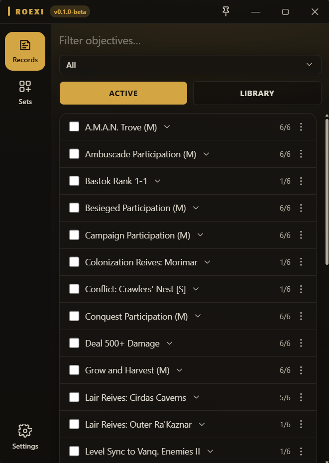
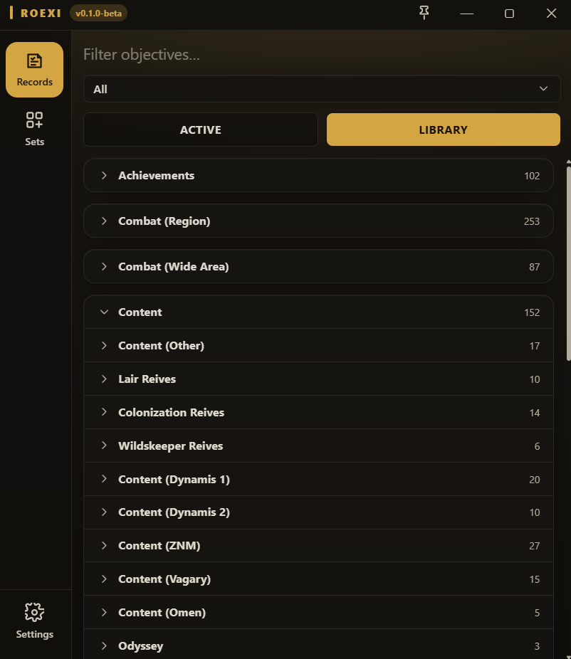
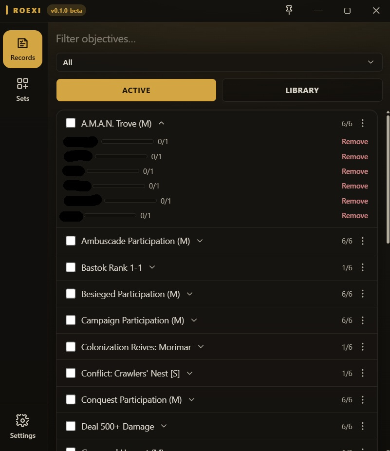
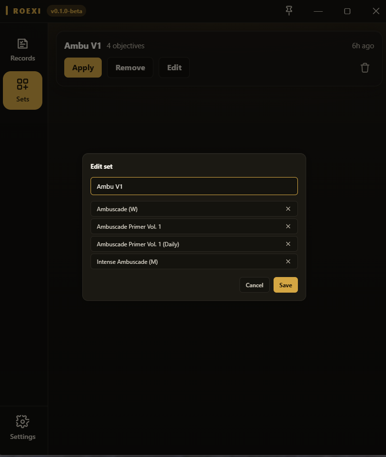

# roexi

  
  

roexi is a desktop app for FFXI multiboxers to view and manage Records of Eminence objectives across up to 6 characters at once, without tabbing through each client's in-game RoE menu one at a time. Built on the same stack and UI language as the open-source [Alexandria](https://github.com/suspiciousman3187/Alexandria) inventory tool.

> roexi is in **BETA**. Core functionality (viewing/setting objectives, Sets) has been run against a real 6-client multibox session, but there may still be bugs — use with that in mind.

## Features

- **Library**: the full ~1,559-objective catalog (ids, names, categories, rewards), searchable and grouped by category/subcategory, with Daily/Repeat tags and per-character active/done state.
- **Active**: every objective currently active on any connected character, with real per-character progress bars. Expand a row to see every character. The ones missing that objective get an **Add** button, or the reason they can't take it (offline, full, completed, auto daily). The row's ⋮ menu can add or remove it across your whole roster.
- **Always-visible slot counts**: each character's `X/30` stays pinned at the top while you scroll, so you can see who has room before you add anything.
- **Safe Add/Remove**: while a change is going through for a character, their buttons grey out with a spinner, so a double-click can't send it twice.
- **Sets**: save a named group of objectives once, then apply or remove it against any subset of your characters in a couple of clicks, instead of re-selecting the same objectives every session.
- **Multi-character throughout**: pick "All" or a single character from one dropdown, and every view/action scopes to that selection.
- **Auto-update**: roexi checks for app and addon updates on launch. **Update all** installs both, and addon updates reload themselves in-game on every client, so there's nothing to type.

## Screenshots

<b>Records</b>: Active, Library, expanded progress

 
<table>
  <tr>
    <td width="50%" align="center"> <em>Active — every objective currently active across your roster</em></td>
    <td width="50%" align="center"> <em>Library — the full objective catalog, grouped and searchable</em></td>
  </tr>
  <tr>
    <td width="50%" align="center"> <em>Expand a row for real per-character progress bars</em></td>
    <td width="50%"></td>
  </tr>
</table>

<b>Sets</b>

 
<table>
  <tr>
    <td width="50%" align="center"> <em>Save a group of objectives once, apply or edit it any time</em></td>
    <td width="50%"></td>
  </tr>
</table>

## Download & Install

Grab the latest build from the [**Releases**](https://github.com/AJHemmings/roexi/releases/latest) page. Two assets are provided:

- **`roexi_<version>_x64-setup.exe`**: the desktop app installer.
- **`roexi-addon-v<version>.zip`**: the companion Windower addon. roexi needs the addon loaded in-game to talk to the app.

**First-time setup**

1. Run the installer.
2. Put the addon in place. Either extract the zip into `Windower\addons\roexi`, or open roexi → **Settings → Addon Version → Set Folder**, pick your Windower `addons` folder, then **Check for Updates → Install**.
3. In-game, run `//lua load roexi` on each character.

After that, updates arrive automatically when you launch roexi.

**Coming from 0.1.0-beta?** 0.1.0's updater can't update itself, so install 0.2.1-beta (or newer) manually once. Run the installer over your current version; no need to uninstall, and your characters and sets are kept. Then install the addon from Settings and run `//lua reload roexi` once in-game. Every update after that is automatic.

## Requirements

- Windows 10 / 11
- Final Fantasy XI installed
- [Windower 4](https://www.windower.net/) with the roexi addon loaded
- WebView2 runtime (pre-installed on modern Windows; auto-installs if missing)

## How it works

- **`src-tauri/`**: the Rust/Tauri shell. Listens on `127.0.0.1:24244` for the addon's connection (Alexandria owns 24233 next door, so both can run at once), persists character state to disk, and exposes a small set of commands the frontend calls over Tauri's IPC.
- **`addon/roexi/`**: the Windower Lua addon. Reports each character's active/completed objectives to the app and injects the accept/cancel packets that actually add or remove a Records of Eminence objective in-game.
- **`src/`**: the React frontend — the Records/Sets/Settings views, the bridge layer that turns the addon's socket traffic into React state, and the batch runner that drives multi-character Add/Remove/Apply operations.

## Troubleshooting

- **"Listener not bound" in the title bar**: roexi can't open its connection port (24244). Hover over it and roexi tells you why: another program is using the port (and which one), roexi is already open in another window, or Windows has reserved the port. Close whatever it names and roexi reconnects automatically.
- **Characters don't show up**: make sure the addon is loaded in-game (`//lua load roexi`) and that its version matches the app. Check **Settings → Addon Version**.

## Bugs

This tool is in beta and there may be bugs. Please use at your own risk, and feel free to open an issue if you find any.

## Credits

- **[suspiciousman3187](https://github.com/suspiciousman3187)**, author of [Alexandria](https://github.com/suspiciousman3187/Alexandria) — roexi's stack, UI language, and overall app architecture are directly inspired by Alexandria. Several parts of this app's code are reused directly from Alexandria's own implementation, most notably the auto-update system (the Rust addon-installer command, the update-check/install frontend, and the Settings update UI).
- **[Windower/Lua's `roe` addon](https://github.com/Windower/Lua/blob/dev/addons/roe/roe.lua)** — the original Records of Eminence Windower addon, used as a reference for building `addon/roexi/roexi.lua`.

The objective catalog is built from third-party data — see `data/LICENSES.md` for the full breakdown:

- Objective ids, names, and category/goal data from [commandobill/roe](https://github.com/commandobill/roe) (MIT).
- Categories, goal counts, and reward figures cross-referenced against [BG-Wiki](https://www.bg-wiki.com/ffxi/Records_of_Eminence).
